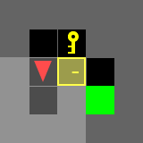
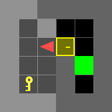
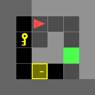
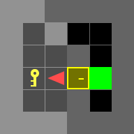
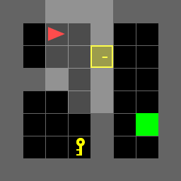
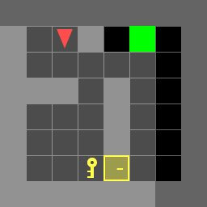
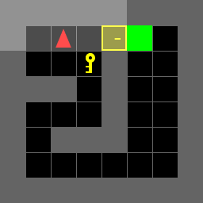

# Dynamic Programming

## Overview
This project studies autonomous navigation in a Door-Key grid environment, where an agent must reach a goal location while interacting with obstacles. The environment is deterministic, meaning state transitions are fully determined by the current state and action.
<p align="center">
</br>
</p>

There are 7 test scenes you have to test and include in the report.

|           doorkey-5x5-normal            |
| :-------------------------------------: |
|  |

|           doorkey-6x6-normal            |            doorkey-6x6-direct            |            doorkey-6x6-shortcut            |
| :-------------------------------------: | :--------------------------------------: | :----------------------------------------: |
|  |  |  |

|           doorkey-8x8-normal            |            doorkey-8x8-direct            |            doorkey-8x8-shortcut            |
| :-------------------------------------: | :--------------------------------------: | :----------------------------------------: |
|  |  |  |

## Installation

- Install Python version `3.8 ~ 3.12`
- Install dependencies
```bash
pip install -r requirements.txt
```

## Instruction
### 1. doorkey.py
You will need to modify **doorkey.py** as the main entrance.

### 2. utils.py
You might find some useful tools in utils.py
- **step()**: Move your agent
- **generate_random_env()**: Generate a random environment for debugging
- **load_env()**: Load the test environments
- **save_env()**: Save the environment for reproducing results
- **plot_env()**: For a quick visualization of your current env, including: agent, key, door, and the goal
- **draw_gif_from_seq()**: Draw and save a gif image from a given action sequence.

### 3. example.py
The example.py shows you how to interact with the utilities in utils.py, and also gives you some examples of interacting with gym-minigrid directly.


## My Implementation

The main implementation is in `doorkey.py`. The program solves the Door-Key environments using deterministic dynamic programming.

### Action Space

The action space is defined as:

```python
MF = 0  # Move Forward
TL = 1  # Turn Left
TR = 2  # Turn Right
PK = 3  # Pickup Key
UD = 4  # Unlock Door
```
## Output

The generated GIFs are saved in the `gif/` folder.

For Part A, the program saves:

```
gif/known_5x5-normal.env.gif
gif/known_6x6-normal.env.gif
gif/known_6x6-direct.env.gif
gif/known_6x6-shortcut.env.gif
gif/known_8x8-normal.env.gif
gif/known_8x8-direct.env.gif
gif/known_8x8-shortcut.env.gif
```

For Part B:

```
gif/random_1.gif
gif/random_2.gif
...
gif/random_36.gif
```

## How to Run

After downloading the project folder, open a terminal and go into the starter code folder:

```bash
cd ECE276B_Project1
pip install -r requirements.txt
python doorkey.py
mkdir -p gif
```

