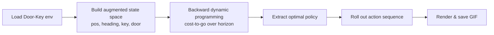
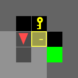
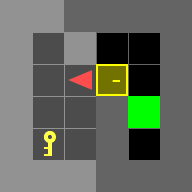
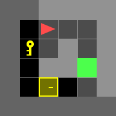
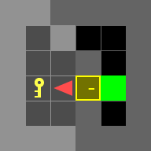
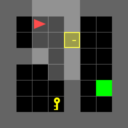
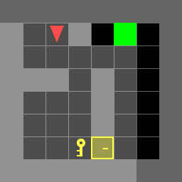
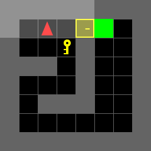

<div align="center">

# Dynamic Programming — Door-Key Navigation

**An optimal-control agent that solves Door-Key grid environments with deterministic dynamic programming — picking up keys, unlocking doors, and reaching the goal along a provably minimum-cost path.**


</div>

---

## Overview

This project tackles autonomous navigation in a **Door-Key grid world**: an agent must reach a goal cell, but the path may be blocked by a locked door that can only be opened after picking up a key. The environment is **deterministic** — each state and action fully determine the next state — which makes it a clean setting for **dynamic programming** to compute an optimal control policy.

The agent is solved in two regimes:

- **Part A — Known maps:** for each fixed environment, DP computes the single optimal action sequence from start to goal.
- **Part B — Random maps:** a single policy is computed over the augmented state space so it generalizes across randomized key/door/goal configurations.

Full derivation and results are in [`Report.pdf`](./Report.pdf).

## Approach

The problem is cast as a finite-horizon deterministic shortest-path problem. The state is augmented beyond position to capture everything that affects future cost — agent location, heading, whether the key is held, and whether the door is open — and DP works backward from the goal to assign an optimal cost-to-go and policy at every reachable state.


```mermaid
flowchart LR
    A[Load Door-Key env] --> B[Build augmented state space<br/>pos, heading, key, door]
    B --> C[Backward dynamic programming<br/>cost-to-go over horizon]
    C --> D[Extract optimal policy]
    D --> E[Roll out action sequence]
    E --> F[Render & save GIF]
```

### Action space

```text
MF = 0   # Move Forward
TL = 1   # Turn Left
TR = 2   # Turn Right
PK = 3   # Pickup Key
UD = 4   # Unlock Door
```

## Repository structure

| Path | Role |
| --- | --- |
| `doorkey.py` | Main entry point — builds the DP solver and produces the optimal control sequence. |
| `utils.py` | Helpers: `step`, `load_env`, `save_env`, `plot_env`, `generate_random_env`, `draw_gif_from_seq`. |
| `create_env.py` | Generates / configures Door-Key environments. |
| `known_maps.py` | Definitions for the fixed (known) test maps. |
| `example.py` | Reference examples for interacting with the env and utilities. |
| `envs/` | Environment assets, including `known_envs/` preview images. |
| `gif/` | Rendered solution GIFs (output). |
| `requirements.txt` | Python dependencies. |
| `Report.pdf` | Technical report with methods and results. |

## Getting started

### Prerequisites

- Python `3.8` – `3.12`

```bash
git clone https://github.com/shambhavi12001/Dynamic-Programming.git
cd Dynamic-Programming
pip install -r requirements.txt
```

### Run

```bash
mkdir -p gif
python doorkey.py
```

Solution GIFs are written to the `gif/` folder.

## Test environments

The known maps span three grid sizes and three layout variants (normal / direct / shortcut):

| | | |
| :---: | :---: | :---: |
| <br/>`5x5-normal` | <br/>`6x6-normal` | <br/>`6x6-direct` |
| <br/>`6x6-shortcut` | <br/>`8x8-normal` | <br/>`8x8-direct` |
| <br/>`8x8-shortcut` | | |

## Output

- **Part A** writes one GIF per known map, e.g. `gif/known_8x8-shortcut.env.gif`.
- **Part B** writes GIFs for each random configuration, e.g. `gif/random_1.gif … gif/random_36.gif`.

## Acknowledgements

Developed as Project of **UCSD ECE 276B: Planning & Learning in Robotics**. The Door-Key environment is based on MiniGrid.

